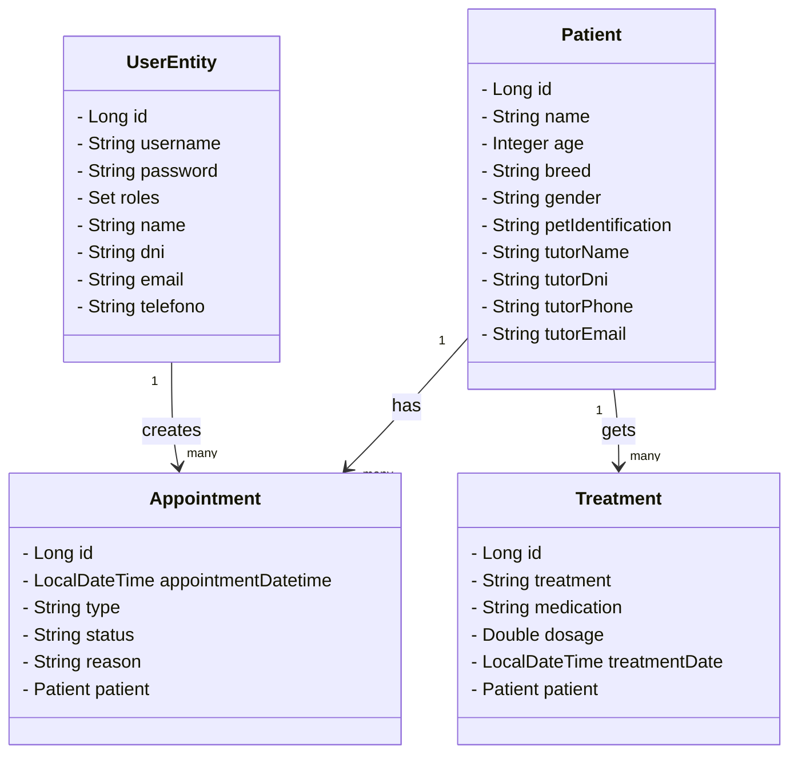

# Oliwa - vet clinic (backend) 🐾

Este proyecto corresponde al **backend** de la aplicación de gestión para la clínica veterinaria **Oliwa**.  
Está desarrollado con **Java Spring Boot** y **MySQL**. Su propósito es ofrecer una API robusta y segura para gestionar **pacientes**, **citas**, **tratamientos** y **usuarios**, garantizando un flujo de trabajo eficiente para administradores y clientes.

## ✨ Características principales
- **Gestión de usuarios y roles** (ADMIN, USER).
- **Autenticación básica** (Basic Auth).
- **CRUD** completo de:
  - Pacientes
  - Citas
  - Tratamientos
  - Usuarios
- Restricciones de acceso según rol:
  - Admin: acceso completo
  - Usuario: acceso limitado a sus recursos
- **Validaciones** de negocio:
  - Máximo 10 citas por día.
  - Cambio automático de estado (*pendiente → pasada*).
  - Eliminación de citas pasadas cada 3 meses.
- **Notificación por email** tras la creación, edición y eliminación de la cita.
- **Configuración CORS** lista para integración con frontend.
- Pruebas y colecciones de **Postman** incluidas.


## 🗂️ Estructura de carpetas
```
├── src/main/java/org/digital_academy/
│   ├── appointment/
│   ├── config/
│   ├── patient/
│   ├── treatment/
│   ├── user/
│   └── util/
├── src/main/resources/
│   ├── application.properties
│   ├── data.sql
│   └── schema.sql
```

## Instalación y ejecución
1. Clona el repositorio:
	 ```
	 git clone https://github.com//clinica-veterinaria/ex-java-springboot-veterinary_clinic-back.git
	 ```
2. Configura la base de datos MySQL (ver `application.properties`).
3. Levanta los servicios con Docker Compose:
   
   [Aquí tienes una guía](https://www.notion.so/1-Instalaci-n-y-preparaci-n-de-Docker-26a5425dd9fa80e5806edc9cdc15691d?source=copy_link)
	 ```
	 docker compose up -d
	 ```
5. Ejecuta la aplicación Spring Boot:
	 ```
	 mvn spring-boot:run
	 ```
  La aplicación se levantará en:
👉 http://localhost:8080

## Endpoints principales
- **Autenticación:**
	- `POST /auth/login`
	- `POST /auth/register`
   
- **Usuarios:**
	- `GET /users`
	- `POST /users`
	- `PUT /users/{id}`
	- `DELETE /users/{id}`
   
- **Pacientes:**
	- `GET /patients`
 	- `GET /patients/{id}`
  	- `GET/patients/tutorDni/{tutorDni}`
  	- `GET/patients/tutorPhone/{tutorPhone}`
  	- `GET/patients/tutorEmail/{tutorEmail}` 
	- `POST /patients`
 	- `PUT /patients/{id}`
   	- `DELETE /patients/{id}`

- **Citas:**
	- `GET /appointments`
 	- `GET /appointments/{id}`
  	- `GET /appointments/patient/{patientId}`
  	- `GET /appointments/upcoming`
  	- `GET /appointments/disponibles`
  	- `GET /appointments/by-date`
	- `POST /appointments`
 	- `PUT /appointments/{id}`
   	- `DELETE /appointments/{id}`

- **Tratamientos:**
	- `GET /treatments`
 	- `GET /treatments/patient/{patientId}` 
	- `POST /treatments`

## 📯 Pruebas en Postman
- Usa la autenticación básica para endpoints protegidos.
- Ejemplo de login:
	- Usuario: `admin`
	- Contraseña: `admin123`

## 🤝 Contribuir
1. Haz un fork del repositorio.
2. Crea una rama para tu feature/fix.
3. Haz tus cambios y crea un pull request.


## 🎯 Diagrama de clases UML


## 🧪 Test coverage


---

> Proyecto desarrollado por Efren, Paula, Sara, Dima y Alberto para la gestión de clínicas veterinarias.
